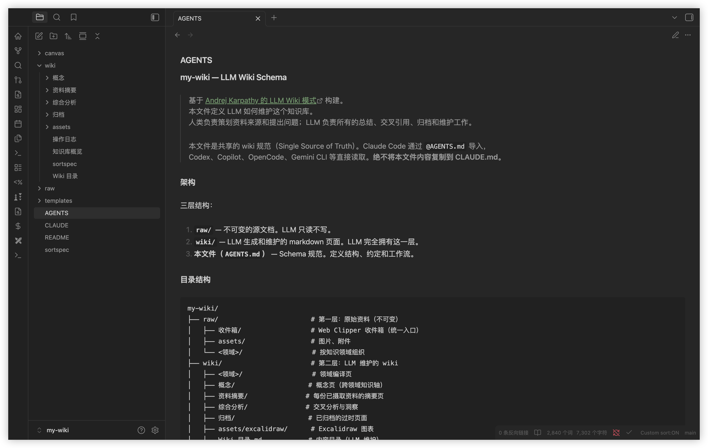

[English](./README.md) | 简体中文

# llm-wiki-starter

一条命令自动搭建 [Andrej Karpathy 的 LLM Wiki](https://gist.github.com/karpathy/442a6bf555914893e9891c11519de94f) AI 知识库。

自动安装 Claude Code + Obsidian + 推荐的插件（Skills & Plugins & 主题 & 快捷键）等，让 AI 帮你持续积累和维护个人知识体系。

自动兼容 Claude Code、Codex、Copilot、Gemini CLI、OpenCode 等主流 AI Agent 使用。



## 安装

```bash
curl -fsSL https://raw.githubusercontent.com/eleven-net-cn/llm-wiki-starter/main/install.sh | bash
```


参数示例：

```bash
# 仅检测、安装全局工具套件（Claude Code、Obsidian、NodeJS、Agent Skills 等）
curl -fsSL https://raw.githubusercontent.com/eleven-net-cn/llm-wiki-starter/main/install.sh | bash -s -- --only-tools

# 跳过全局工具套件的检测、安装，仅创建 wiki 知识库
curl -fsSL https://raw.githubusercontent.com/eleven-net-cn/llm-wiki-starter/main/install.sh | bash -s -- --only-wiki

# 跳过全局工具套件的检测、安装和 wiki 知识库创建，仅在当前所在仓库初始化配置推荐的 Obsidian 插件、主题、快捷键等配置
curl -fsSL https://raw.githubusercontent.com/eleven-net-cn/llm-wiki-starter/main/install.sh | bash -s -- --only-obsidian
```

### 参数

支持的参数，按需选用：

| 参数 | 说明 | 默认值 |
|------|------|--------|
| `--name <name>` | Wiki 名称 | `my-wiki` |
| `--dir <directory>` | 目标目录 | `./<name>` |
| `--lang <en\|zh>` | Wiki 语言 | `en` |
| `--yes, -y` | 跳过所有提示，使用默认值 | - |
| `--only-tools` | 仅安装工具套件，不创建 wiki 知识库 | - |
| `--only-wiki` | 仅创建 wiki 和 Obsidian 配置，不安装工具 | - |
| `--only-obsidian` | 仅在已有 vault 中配置 Obsidian | - |

### 检测安装

自动检测系统已有工具，只安装缺少的部分：

**工具 & Skills**

- ✅ **Claude Code** — 默认推荐的 AI Agent
- ✅ **Node.js** — Claude Code 和 Skills CLI 运行时
- ✅ **Obsidian** — Wiki 编辑器和可视化图谱查看器
- ✅ **[kepano/obsidian-skills](https://github.com/kepano/obsidian-skills)** — Obsidian Markdown、CLI 交互、Bases 数据库视图、网页清洗（defuddle）
- ✅ **[axtonliu/visual-skills](https://github.com/axtonliu/axton-obsidian-visual-skills)** — Excalidraw 图表、Mermaid 可视化、Obsidian Canvas、JSON Canvas
- ✅ **Git** — 版本控制（可选）

> Skills 通过 [Skills CLI](https://github.com/vercel-labs/skills) 全局安装，跨 Agent 共享。

**Obsidian**

- **插件**（16 个插件：8 Core + 8 UX，随 wiki 自动配置）

    Core 插件（llm-wiki 核心功能必需）：

    - ✅ **Dataview** — 基于 frontmatter 的 SQL 风格查询
    - ✅ **Templater** — 页面模板系统
    - ✅ **Linter** — 自动 Markdown 格式化
    - ✅ **Custom Sort** — 通过 sortspec 控制文件浏览器排序
    - ✅ **Obsidian Git** — 自动 git 提交/推送（需 Git）
    - ✅ **Tag Wrangler** — 重命名、合并和管理标签
    - ✅ **Strange New Worlds** — 显示 wikilink 引用计数
    - ✅ **Homepage** — 打开 vault 时设置首页

    UX 插件（增强 Obsidian 编辑体验）：

    - ✅ **Omnisearch** — 全库模糊搜索
    - ✅ **Switcher++** — 快速切换器，支持标题导航
    - ✅ **Minimal Theme Settings** — Minimal 主题配置
    - ✅ **Hider** — 隐藏 UI 元素，界面更简洁
    - ✅ **Editing Toolbar** — Word 风格编辑工具栏 + F11 全屏快捷键
    - ✅ **Excalidraw** — 手绘风格图表
    - ✅ **Quiet Outline** — 增强大纲视图
    - ✅ **Open in Terminal** — 打开 vault 到终端

- **主题**

    ✅ **Minimal** — 简洁、无干扰主题（自动下载）

- **快捷键**

    - `Cmd+Shift+F` → Omnisearch（模糊搜索）
    - `Cmd+R` → 快速切换器（标题导航）
    - `Cmd+F11` → 工作区全屏
    - `Cmd+Shift+F11` → 编辑器全屏专注

**浏览器扩展（推荐使用，不会自动安装）**

- **[Obsidian Web Clipper](https://chromewebstore.google.com/detail/obsidian-web-clipper/cnjifjpddelmedmihgijeibhnjfabmlf)** — 将网页文章直接剪藏到 `raw/收件箱/` 供 LLM 摄取

## 开始使用

```bash
# 用 Obsidian 打开
cd my-wiki && open -a Obsidian .

# 启动 AI Agent（也可使用 codex / copilot / gemini 等）
claude
```

然后与 AI 对话：

- **摄取** → `摄取这篇文章：https://example.com/some-article`
- **查询** → `X 和 Y 之间有什么关系？`
- **巡检** → `运行一次 wiki 巡检`

## 知识库结构

```
my-wiki/
├── raw/                     # 不可变的源文档（LLM 只读）
│   ├── 收件箱/               # Web Clipper 收件箱（摄取时自动分类）
│   ├── <领域>/               # 按知识领域组织
│   └── assets/              # 图片、附件
├── wiki/                    # LLM 维护的知识库
│   ├── <领域>/               # 领域编译页
│   ├── 概念/                 # 概念定义页
│   ├── 资料摘要/             # 资料摘要页
│   ├── 综合分析/             # 交叉分析
│   ├── 归档/                 # 已归档页面
│   └── assets/excalidraw/   # 图表
├── canvas/                  # JSON Canvas 可视化地图
├── templates/               # 页面模板（每种 type 一个，LLM 创建页面时引用）
├── AGENTS.md                # Wiki 规范（唯一真相源）
└── CLAUDE.md                # Claude Code 配置（导入 AGENTS.md）
```

> **提示**：领域目录（如 `AI Agent/`、`机器学习/`）会在首次摄取时自动创建。告诉 AI 你的知识属于什么领域，或者让它根据内容自行判断。

## 什么是 LLM Wiki？

[LLM Wiki](https://gist.github.com/karpathy/442a6bf555914893e9891c11519de94f) 是 Andrej Karpathy 提出的知识管理模式：不同于传统 RAG 每次查询从零检索，LLM **增量式地构建和维护一个持久化的 wiki** —— 交叉引用自动建立，矛盾被标记，综合分析持续更新。每次添加新资料都会让 wiki 更丰富。

**适用场景**：个人知识管理、技术调研、领域学习笔记、团队知识库 —— 任何需要 AI 帮你长期积累和整理知识的场景。

**工作方式**：[Claude Code](https://claude.ai/claude-code) 作为 AI Agent 负责读写和维护 wiki；[Obsidian](https://obsidian.md) 作为可视化编辑器和阅读器。你通过与 AI 对话来摄取资料、查询知识、运行巡检 —— 同时在 Obsidian 中浏览和导航知识图谱。

**三层架构**：`raw/`（不可变源文档）→ `wiki/`（LLM 维护的页面）→ Schema（`AGENTS.md`）

**三大操作**：**Ingest**（摄取）→ **Query**（查询）→ **Lint**（巡检）

## 致谢

- [Andrej Karpathy — LLM Wiki](https://gist.github.com/karpathy/442a6bf555914893e9891c11519de94f)

## License

[MIT](LICENSE)
